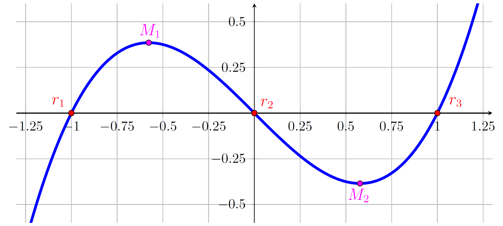
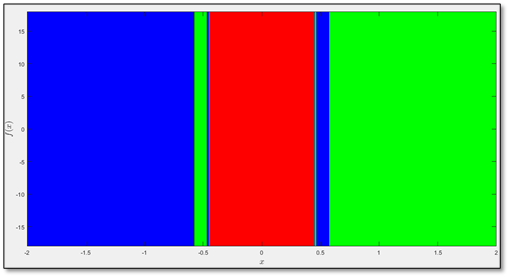
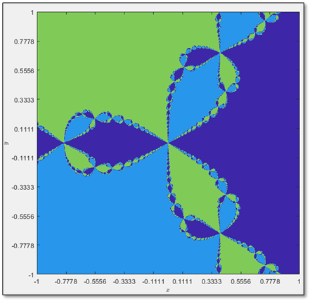

# Fractales de Newton

## Introducción a fractales

### ¿Qué es un fractal?

Un fractal es una imagen que muestra porcesos iterativos que se repiten al infinito; es una figura autosemejante, es decir, es una figura que se parece a cada parte que la compone a diferentes escalas. 

En la naturaleza podemos observar diferentes fractales. Las hojas de un helecho, las nubes, el sistema circulatorio, las líneas costeras​ o los copos de nieve son fractales naturales.


### ¿Cómo modelar un fractal?

Hay varias maneras de modelar un fractal, en este caso utilizamos el método de Newton, por eso el nombre de Fractales de Newton. Caley fue el matemático que propuso utilizar el método de Newton para encontrar raíces de una función definida en el plano complejo. Caley analizó las cuencas de atracción que son el conjunto de puntos en el plano complejo tales que si aplicas el método de convergencia de Newton convergen a una raíz determinada. Al colorear las diferentes cuencas de atracción de una función compleja de diferentes colores podemos observar un fractal.


## ¿Cómo usar el programa? (pau)

### Instalación

### Uso

## Construcción del programa

A muy grandes rasgos, el programa:
1. calcula las raíces de la función que le pasamos como argumento;
1. genera una cuadrícula en donde cada punto de la cuadrícula se puede representar por un número complejo;
1. aplica el Método de Newton usando a cada punto de la cuadrícula como punto de partida y se fija en qué raíz se acerca más después de un número determinado de iteraciones;
1. asigna un color a cada punto según la raíz a la que dicho punto inicial haya convergido, y
1. grafica la cuadrícula resultante.

### 1. Cálculo de raíces de la función
Si bien esta parte no es necesaria y podríamos simplemente pasar como parámetros las raíces de la función, decidimos incluirlo en el código para facilitar las pruebas y evitarle al usuario la fatiga de calcularlas. Para obtenerlas, usamos el cálculo simbólico de Matlab y almacenamos los resultados en un arreglo. También guardamos el número de raíces que hay.

```matlab
syms z
eq = f(z) == 0;
sol = solve(eq);
roots = double(sol);
n = length(roots);
```

### 2. Grid que funciona como el campo complejo
Nos basaremos en los límites que fueron pasados como parámetros. En orden, los parámetros que se pasan en la función son:
1. límite inferior del eje real
2. límite superior del eje real
3. límite inferior del eje imaginario
4. límite superior del eje imaginario

También tenemos el parámetro `res`, que indicica el número de puntos en el que dividiremos cada recta, por lo que usaremos el comando `linspace()` de Matlab para almacenar cada uno de los valores de las rectas en un arreglo por separado. Posteriormente, con `meshgrid()` haremos dos matrices, `X` y `Y`, cuyas entradas serán copias de las filas y columnas de `x` y `y`, respectivamente. Para casi concluir, combinaremos ambas matrices en una misma matriz `Z`, no sin antes multiplicar a `Y` por `i`, para que realmente almacenemos números complejos. Finalmente, crearemos una matriz del mismo tamaño que `Z`, pero con puros ceros; esta matriz nos servirá en la siguiente sección.

```matlab
x = linspace(lims(1), lims(2), res); 
y = linspace(lims(3), lims(4), res);
[X,Y] = meshgrid(x,y);
Z = X + 1i*Y;
C = zeros(size(Z));
```

### 3. Método de Newton para cada punto
Para esta parte, aprovecharemos el código ya construido que calcula la raíz de una función usando el método de Newton y partiendo de un punto dado. Esto lo haremos para cada punto `(i, j)` de la matriz `Z` y almacenaremos el resultado nuevamente ahí. Esto se logra con el comando 
```matlab
[Z(i,j), ~, ~] = metodoNewtonRaices(f, df, Z(i,j), 1e-6);
``` 


### 4. Asignación de un color a cada punto
Para asignar el color, compararemos cada resultado con cada una de las raíces que tenemos y, si el resultado obtenido es menor que una cota arbitraria (en este caso estamos usando 0.001), entonces almacenaremos en la matriz `C` el número que corresponde a esa raíz. Es decir, al final, la matriz `C` quedará con puros números enteros del 0 a n, donde cada número corresponde a la raíz a la que convergió el punto inicial y, si no se converge a ningún punto, entonces se tendrá 0.

Entonces, para cada entrada `(i, j)` de la matriz `Z`, hacemos:
```matlab
for k = 1:n
    if abs(Z(i,j) - roots(k)) < 0.001
        C(i,j) = k;
    end
end
```

En realidad, hacemos los pasos 3 y 4 en el mismo recorrido de la matriz, para que el programa sea un poco más eficiente. Así pues, nuestro código queda:
```matlab
for i = 1:length(y)
    for j = 1:length(x)
        [Z(i,j), ~, ~] = metodoNewtonRaices(f, df, Z(i,j), 1e-6);
        
        for k = 1:n
            if abs(Z(i,j) - roots(k)) < 0.001
                C(i,j) = k;
            end
        end
    end
end
```

### 5. Gráfica
El último paso es bastante simple; lo único que vale la pena mencionar aquí es que tenemos que orientar correctamente el eje imaginario. Nosotros escogimos el mapa de colores `bone`, pero el usuario puede poner el que más le parezca.

```matlab
figure
image(lims(1:2), lims(3:4), C, 'CDataMapping','scaled');
colormap(bone(n+1));

set(gca, 'YDir', 'normal');
set(gca, 'XTick', linspace(lims(1), lims(2), 5));
set(gca, 'YTick', linspace(lims(3), lims(4), 5));
```

## Intuición matemática detrás del programa

### El método de Newton
Para explicar por qué realizamos cada paso, primero vamos a explicar brevemente el Método de Newton: es un algoritmo recursivo que permite obtener las raíces de una función si conocemos únicamente la regla de correspondencia, la derivada y una aproximación inicial, denotada $x_0$. Si $x_n$ es nuestra aproximación actual, la regla para calcular la siguiente aproximación ($x_{n+1}$) es la siguiente:

$$ x_{n+1} = x_n - \frac{f(x_n)}{f'(x_n)}. $$

Básicamente, lo que el método nos dice es que, dado un punto en el eje $x$, podemos "acercarnos" a la raíz de una función si evaluamos ese punto en la función, tomamos la pendiente en el resultado y, siguiendo la pendiente, avanzamos hasta llegar al eje de las abscisas; el punto en donde crucemos al eje será nuestra nueva aproximación. Este proceso está muy bien ilustrado en la siguiente animación:


### Cuencas de atracción
Ahora bien, los más matemáticamente inclinados se habrán preguntado ya: ¿qué pasa cuando la función tiene más de una raíz? La intuición nos dice que, como no podemos cambiar ni la función ni la derivada, entonces diferentes puntos iniciales nos llevarán a diferentes raíces. Veamos la siguiente gráfica de $f(x)=x^3-x$. El lector podrá verificar que si empezamos a la izquierda de $M_1$, el Método de Newton nos va a dejar cerca de $r_1$ y, si empezamos a la derecha de $M_2$, vamos a terminar en $r_3$.



Hagamos algo más interesante: ¿qué pasa si empezamos entre $M_1$ y $M_2$? ¡Es un caos! Puede que terminemos en cualquiera de las tres raíces. Para no dejar al lector con la imaginación volando, vamos a colorear a todos los puntos que nos lleven a $r_1$ de color azul, a los que nos lleven a $r_2$ de rojo y a los que nos lleven a $r_3$ de verde. Podemos esperar que todos los puntos a la izquierda de $M_1$ se vean azules y todos los puntos a la derecha de $M_2$ se vean verdes. Así pues, fijémonos en lo que pasa en medio: el comportamiento en las zonas cercanas a -0.5 y a 0.5 es precisamente el comportamiento que queremos mostrar: fractal.



### Extensión al plano complejo
El brinco más grande que vamos a dar aquí es que, en vez de evaluar una función con números reales, la evaluaremos con números complejos. Entonces $x_0$, nuestro punto inicial, no va a ser un número del eje $x$, sino un punto del plano complejo. El método sigue siendo el mismo y, además, también se cumple que distintos puntos iniciales nos llevarán a distintas raíces. Tomemos, por ejemplo, al polinomio $f(z) = z^3 - 1$. Como es de grado tres, entonces tiene tres raíces (reales o complejas). Si tomamos a los puntos del plano complejo como puntos iniciales del Método de Newton y los coloreamos según la raíz en la que terminan, obtenemos, finalmente, un fractal:



Lo único que nos queda por cambiar, pues, es la función que vamos evaluando y la parte del plano complejo en la que nos vamos fijando (podemos acercarnos, alejarnos o movernos). Para eso es el programa; para que el lector juegue y se divierta.

## Referencias
- [GIF de Animación del Método de Newton](https://commons.wikimedia.org/wiki/File:NewtonIteration_Ani.gif)